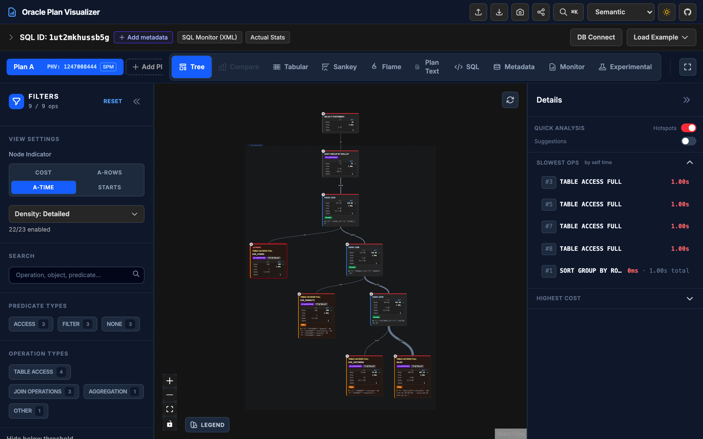
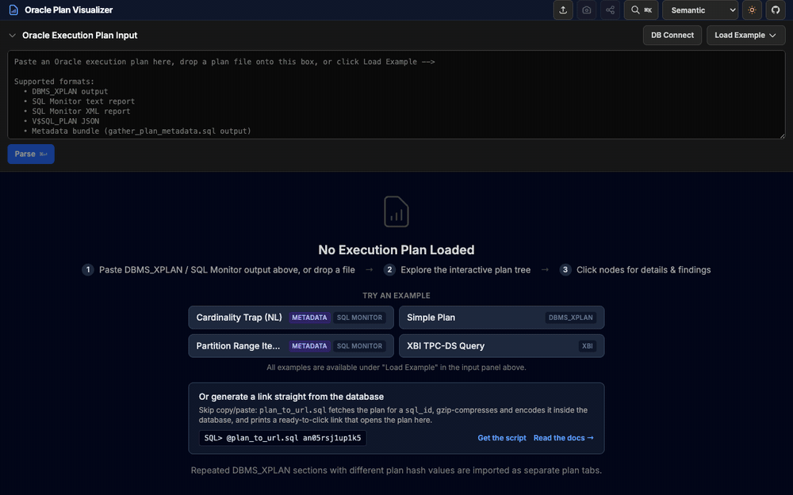
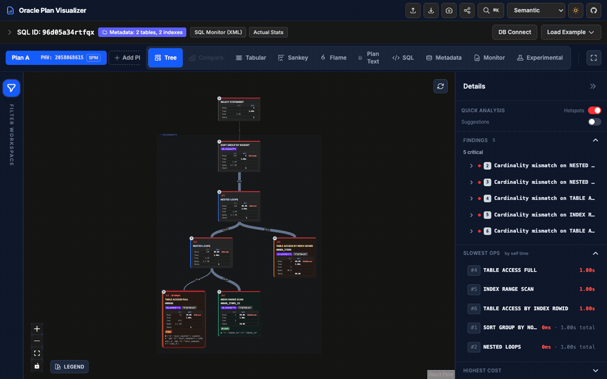
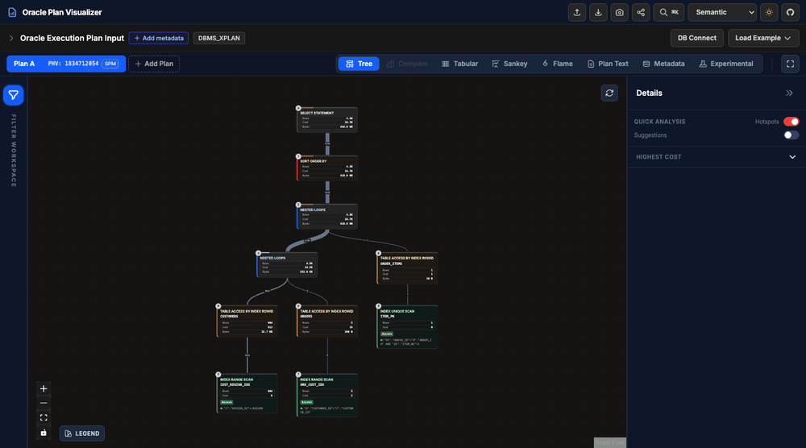
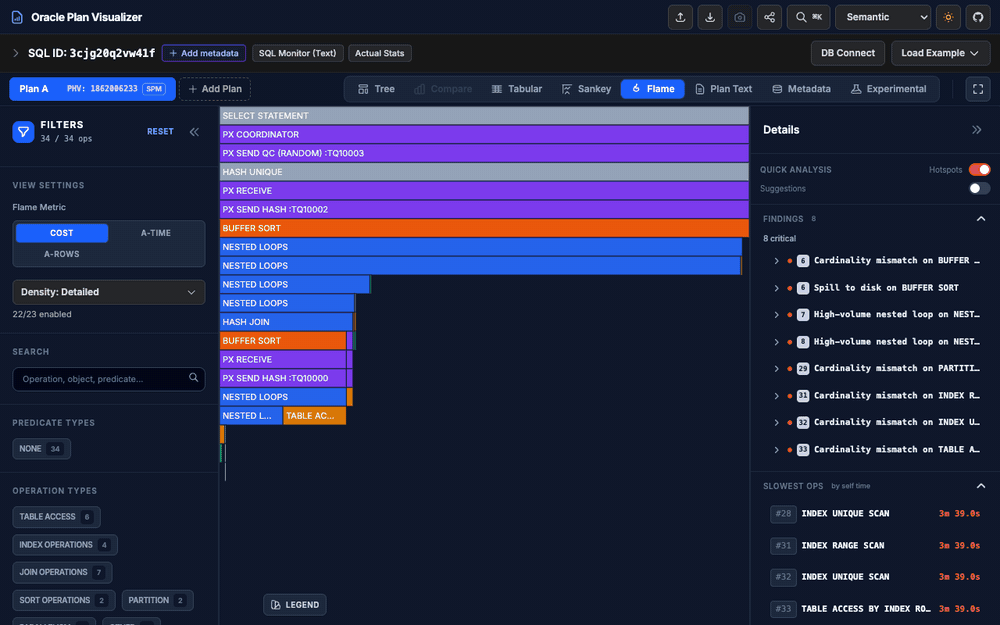
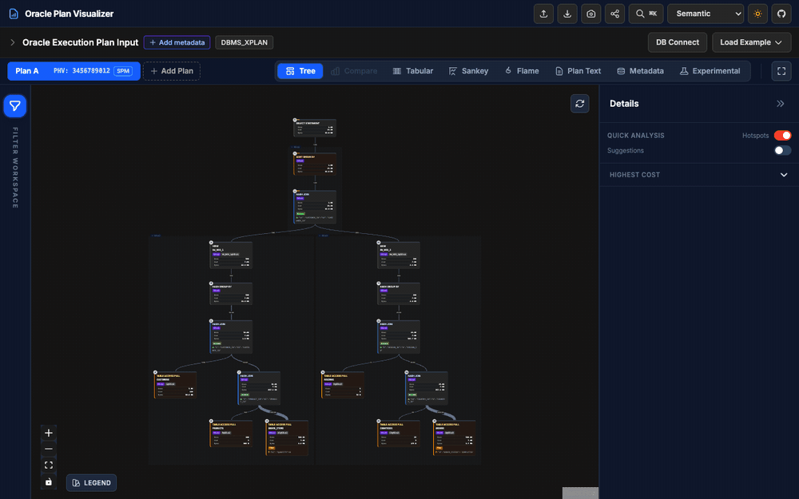
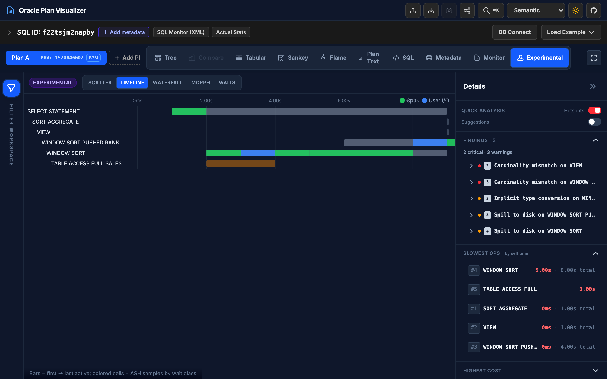

# Oracle Execution Plan Visualizer

**[Open the app](https://davidbudac.github.io/ora-explain-plan-viz/)** — paste a DBMS_XPLAN, SQL Monitor (text/XML), JSON or xbi.sql plan and get an interactive, annotated picture of it. Runs 100% in your browser: no backend, no account, nothing is uploaded.

[](https://davidbudac.github.io/ora-explain-plan-viz/?example=21)

Try it with the **Load Example** menu, or see [how to get a plan out of Oracle](docs/input-formats.md).

## What it does

### Paste → explore

Auto-detects the format, draws the plan tree, and opens full details (estimates, actuals, predicates, metadata) for any node. Arrow keys walk the tree.



### Find the problem

Advisor findings (cardinality mismatches, spills, high-volume nested loops, …) and the slowest operations are listed up front — click one to jump to the node.



### Compare two plans

Load a before/after pair, view them side by side, then switch to the Compare dashboard for per-operation deltas. `Cmd+K` opens the command palette for everything else.



### Flame graph

Where does the time (or cost) go? Bars are sized by self value; double-click to zoom into a subtree.



### Annotate & share

Notes and colour highlights on nodes, exported as JSON or baked into a shareable URL.



### AI plan analysis

Optional AI-assisted review of the loaded plan (or a plan-A vs plan-B comparison): pick a provider (Anthropic, an OpenAI-compatible endpoint, or the local DB agent build), click Run, and get a streamed report with findings linked back to plan nodes.

**Privacy note**: everything stays in your browser until you click Run — only then is the plan (and optional schema metadata) sent to the provider you chose. API keys are kept in sessionStorage only and are never baked into URLs or saved settings.

### And more

| | |
|---|---|
| **Tabular / Sankey / Plan Text / SQL** views | **Filters** by operation, predicates, cost/rows/time ranges, cardinality mismatch |
| **Experimental** views — timeline Gantt with ASH wait classes, E-Rows vs A-Rows scatter, wasted-work waterfall | **Schema metadata** — attach table/index/column stats, browse them in the Metadata explorer |
| **SQL Plan Baseline** script generator (DBMS_SPM) | **Shareable URL straight from the DB** via [`scripts/plan_to_url.sql`](scripts/plan_to_url.sql) |



## Run it yourself

```bash
git clone https://github.com/davidbudac/ora-explain-plan-viz.git
cd ora-explain-plan-viz && npm install && npm run dev      # http://localhost:5173
```

Docker: `npm run docker:build && npm run docker:run` (port 8080). Set `APP_BASE_PATH=/sub/path/` at build time for sub-path deployments.

Optional: fetch plans directly from your database with the local [`oraplanviz-agent`](https://github.com/davidbudac/oraplanviz-agent) companion (`VITE_ENABLE_DB_AGENT=1 npm run dev`; credentials never leave your machine).

## License

MIT
